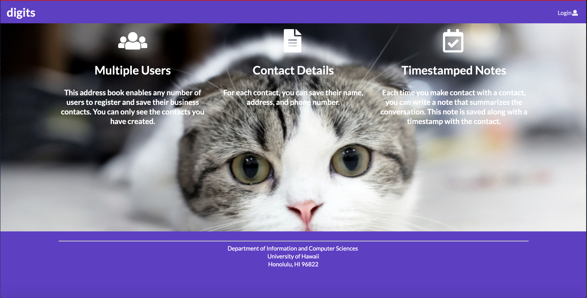

Installation Instructions
Download the repository to your local machine. Then move into the app directory in your terminal. Install meteor
using the following command: meteor npm install. Once meteor is installed run the command: meteor npm run start.
You can then navigate to your localhost found at http://localhost:3000. Then you are ready to go!

Regular User Page Breakdown:
Landing page: Here is the homepage that will be shown the first time you navigate to the website.
Sign up: This page is where you would create your own account.
Log in: Here is where you would go to log in if your account was already created.
Add Contact: This is the page where you would be able to add in new contacts. There are different fields that you
        can add such as their name, address, a photo of them and a description of them.
List Contacts: This page will list all your contacts that you have added. There is also the functionality to add
        a timed stamped note to a specific contact.
      
Admin Page Breakdown:
In addition to the Regular User pages an admin role will also have access to an Admin page. This page will display
all users contacts and whose account they are associated with. 
